# BullMQ — Async Job Processing

This document covers the decisions behind the queue architecture, worker design, retry strategy, dead letter queue, scheduler pattern, and email layer. The code is in `src/queues/` and `src/workers/` — this document explains why it's structured the way it is.

---

## Why BullMQ

The core principle is that an HTTP request should do exactly one thing: mutate the database and return. Everything else — sending emails, writing audit logs, scheduling reminders, generating reports — is a side effect that doesn't need to block the response.

Without a queue, side effects happen inline. If Resend is temporarily down, the entire request fails even though the database write succeeded. If the audit log write fails after an email already sent, the system is in an inconsistent state. There's no retry mechanism — if it fails once, it's gone. CPU-heavy work like report generation blocks the event loop and slows down every other request while it runs.

BullMQ solves all of this. The service layer enqueues jobs after each database mutation — an operation that takes roughly one millisecond and never fails the request. Workers pick up those jobs independently, retry them on failure, and handle each concern at its own pace. The HTTP response returns immediately regardless of what happens downstream.

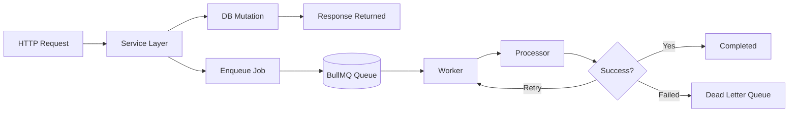

---

## Two Redis connections

BullMQ has a hard requirement that the Redis connection passed to it must have `maxRetriesPerRequest` set to null. This is because BullMQ uses blocking Redis commands internally, and a non-null value causes it to throw. The general-purpose Redis client used for caching and health checks has normal retry behaviour, which is incompatible with BullMQ's needs.

Rather than compromising either client, two separate connections are maintained. The general client behaves normally for caching and health checks. The BullMQ client satisfies BullMQ's requirements without affecting anything else. They connect to the same Redis instance — the separation is purely about connection configuration.

```mermaid
flowchart LR
    API --> CacheClient[Redis Client (Cache)]
    API --> QueueClient[Redis Client (BullMQ)]

    CacheClient --> Redis[(Redis)]
    QueueClient --> Redis
```

---

## One queue per concern

Each type of work has its own queue rather than a single shared queue for everything. This matters because different types of work have fundamentally different characteristics.

Activity log writes are lightweight database inserts. They can run at high concurrency, retry quickly with short delays, and benefit from aggressive retry counts because a missed audit entry is genuinely bad. Email sends involve an external API with rate limits — they need moderate concurrency, slightly longer retry delays to avoid hammering Resend immediately after a failure, and a rate limiter that enforces throughput across all worker instances. Report generation is CPU and memory intensive, needing very low concurrency to avoid memory pressure and longer retry delays because repeated failures usually indicate a data problem rather than a transient network issue.

If all of these shared one queue with one concurrency setting and one retry config, you'd be forced to choose the most conservative settings for everything or risk overwhelming either the database, the email provider, or the worker's memory. Separate queues mean each concern gets exactly what it needs.

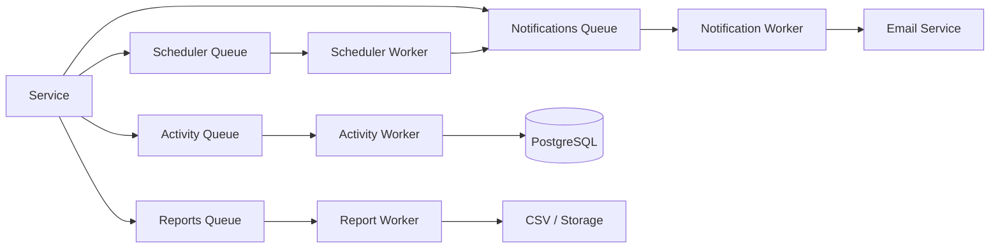

---

## Typed job payloads

Every queue is typed with its own payload structure. This isn't just for IDE autocomplete — it has a real operational consequence.

The notification queue uses a discriminated union on a `type` field. When the processor switches on this field, TypeScript narrows the type in each branch so only the relevant fields are accessible. More importantly, the exhaustive check at the end of the switch means adding a new notification type to the type definition without adding a corresponding handler in the processor is a compile error. You cannot accidentally ship a notification that silently does nothing because the handler is missing — the build fails first.

The `occurredAt` field in activity job payloads deserves specific mention. This timestamp is set in the service layer at the moment the action happens, not inside the processor when the job runs. If the queue is under load and a job waits ten minutes before being processed, the audit log still records when the task was actually assigned, not when the log entry was written. This distinction matters when displaying activity feeds to users.

---

## Retry strategy

Each queue's retry configuration reflects the nature of the work and the consequence of failure.

Activity logs retry eight times with a short base delay. The combination of idempotent writes and high retry count means the system tries very hard to record every action. Missing an audit entry is bad, and each attempt is cheap, so aggressive retrying makes sense.

Notification emails retry five times with a slightly longer base delay. The longer initial delay avoids immediately retrying against a provider that just returned an error — giving it a moment to recover before the next attempt. Five attempts is enough to ride out most transient outages without keeping the job alive indefinitely.

The scheduler queue retries only three times with a long delay. If the scheduler fails to enqueue a notification job, something systemic is likely wrong rather than a transient blip. Three attempts with breathing room between them is appropriate.

Report generation also retries three times but with the longest base delay of all. Repeated failures here almost always indicate a problem with the data being queried or the generation logic rather than a network issue. Retrying quickly doesn't help, and each attempt is expensive.

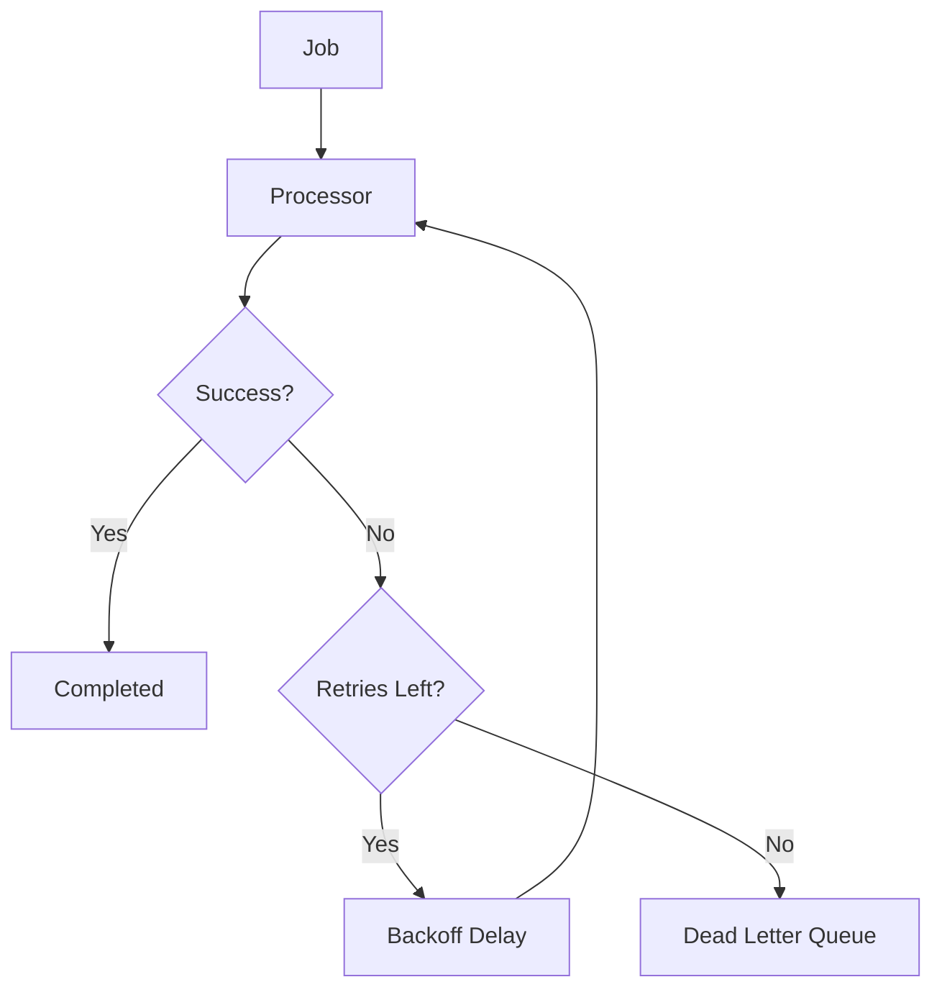

---

## Idempotency

Two layers of idempotency are applied throughout the system.

At the queue level, notification jobs are enqueued with deterministic job IDs constructed from the relevant entity IDs. If the same event triggers twice — a bug causes two assignment calls, for example — only one job is enqueued. BullMQ silently ignores the second call when a job with that ID already exists in the queue.

At the database level, every activity log insert includes the BullMQ job ID and uses an `ON CONFLICT DO NOTHING` clause on that column. BullMQ guarantees the same job keeps the same ID across all retry attempts. So if the process crashes after the insert succeeded but before BullMQ marked the job complete, the retry finds the row already exists and does nothing. The combination of these two layers means duplicate notifications and duplicate audit entries are both structurally prevented rather than guarded against with conditional logic scattered across the codebase.

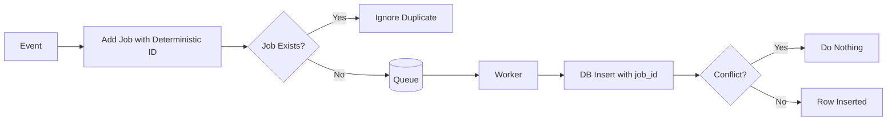

---

## The scheduler pattern

The scheduler queue is the most conceptually different from the others. Every other queue processes jobs as soon as they arrive. The scheduler holds jobs with a delay and only releases them to the worker after that delay has elapsed. This is how due date reminders are implemented — a job is enqueued with a delay calculated as the time between now and twenty-four hours before the task's due date. The job sits in Redis for however long that is, fires at the right moment, and the scheduler processor handles it.

An important design decision is that the scheduler processor does not send emails itself. It only enqueues a notification job. This separation keeps retry behaviour isolated. If Resend is down at the exact moment a reminder fires, the scheduler job succeeds — it did its job, which was to fire at the right time. The notification queue then handles email delivery failures with its own retry config. Without this separation, a Resend outage would cause the scheduler to retry for days and potentially send multiple reminder emails once the outage resolved.

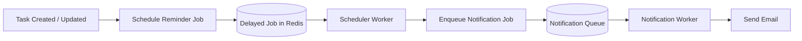

When a task's due date changes, the old reminder must be cancelled and a new one scheduled. The `upsertDueReminder` helper encapsulates the remove-then-add pattern. The deterministic job ID — always constructed from the task ID — is what makes this possible. The system always knows exactly which job to remove without searching. Completing a task also cancels any pending reminder automatically — there is no point sending a reminder for work that is already done.

---

## Dead letter queue

When a job exhausts all its retry attempts, it doesn't simply disappear. It is forwarded to a dedicated dead letter queue along with the original payload, the error message, the stack trace, and a count of how many times it was attempted. This queue has no automatic retries — it is a holding area for jobs that need human attention.

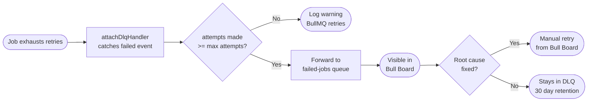

The DLQ entry contains everything needed to understand what went wrong: which queue the job came from, what data it was processing, and what error it encountered on the final attempt. From Bull Board, the payload can be inspected, the root cause identified and fixed, and the job manually retried once the underlying issue is resolved. DLQ entries are kept for thirty days.

---

## Workers as a separate process

The worker process runs completely independently of the Fastify API server. They start separately, scale separately, and fail separately. A crash in the worker process does not affect the API. Deploying a new version of the API does not interrupt in-flight jobs. A CPU-heavy report job consuming significant memory does not slow down HTTP request handling.

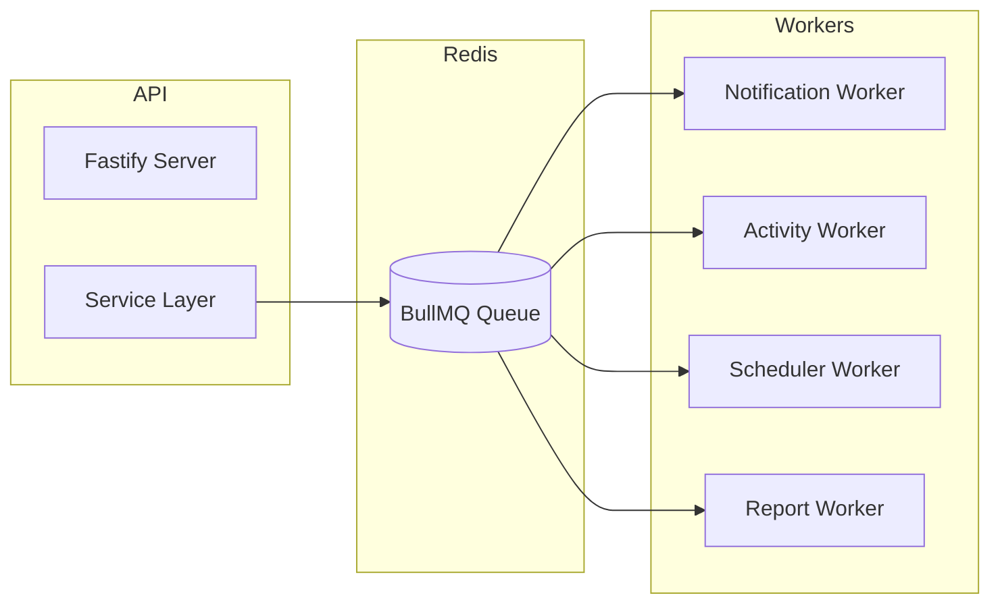

In Docker, both services are built from the same image. The only difference is the command used to start the container. The API container runs the compiled API entrypoint. The worker container runs the compiled worker entrypoint. One build produces both — there is no separate worker image to maintain.

Graceful shutdown is handled by listening for termination signals. When one arrives, the workers stop accepting new jobs and wait for currently running jobs to finish before closing their Redis connections. Docker sends `SIGTERM` when stopping a container and waits ten seconds before forcefully killing it. The production Docker command uses exec form rather than shell form. Shell form routes the termination signal through the shell process rather than delivering it directly to Node — the graceful shutdown handler never runs and jobs are interrupted mid-execution. Exec form delivers the signal directly.

---

## Email architecture

The email layer is split into two distinct responsibilities. The Resend wrapper handles the mechanics of sending — constructing the API call, handling errors, and returning a result. The templates handle the content — what each email says and how it looks.

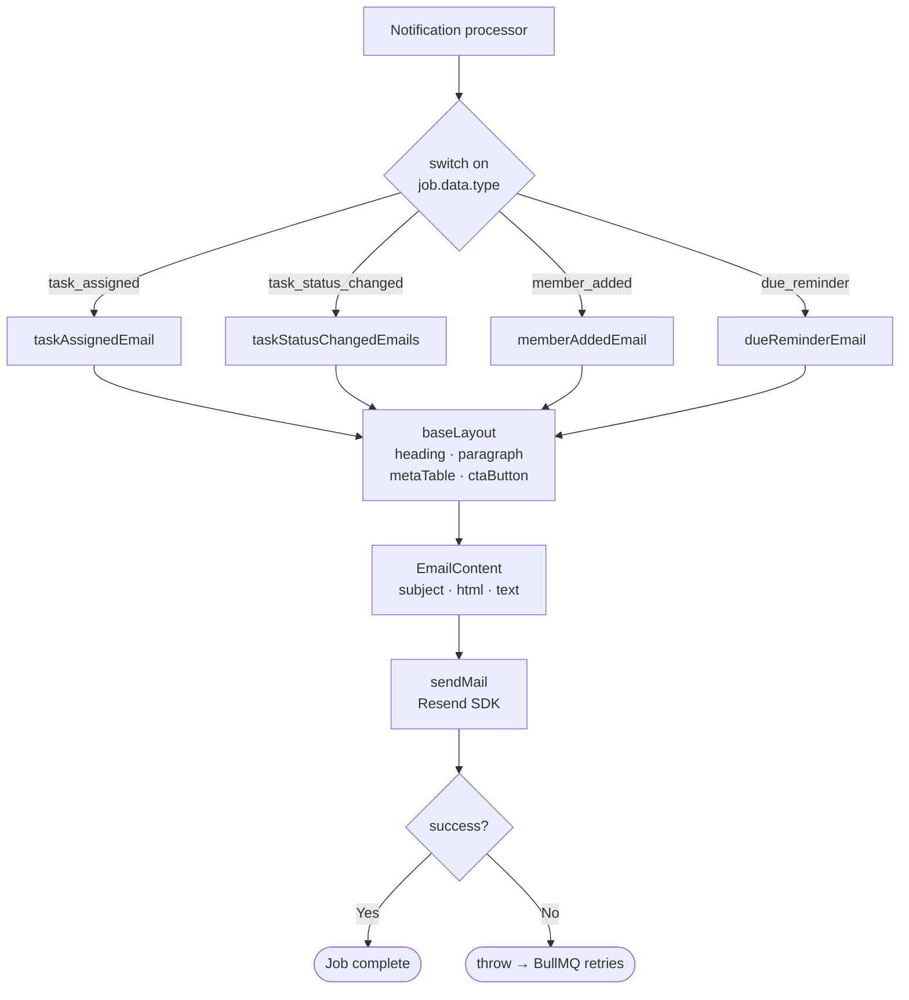

The wrapper never throws. It always returns a success or failure result. This puts retry responsibility exactly where it belongs — in the processor, which decides whether a failure should trigger a BullMQ retry. The template layer is split into a base layout and notification-specific templates. The base layout knows nothing about tasks or projects. When the email design needs to change, it changes in one place and every template inherits it. Every template produces both an HTML version and a plain text version — some corporate email clients block HTML rendering entirely and without a plain text fallback those users receive a blank email.

---

## Integration in the service layer

Queue calls always happen after the database mutation succeeds, never before. The database is the source of truth. The ordering within the enqueue calls follows a simple priority: activity log first, then notifications, then scheduler updates. Activity logs are the most important side effect — they should be enqueued before anything else so that if the process crashes mid-enqueue, the audit trail is preserved even if the notification is lost.

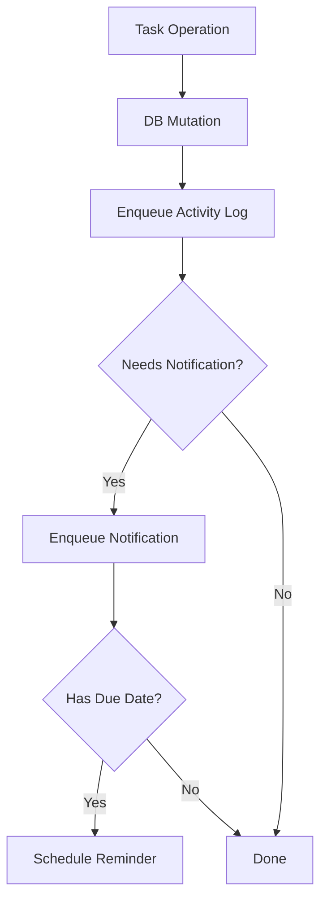

---

## Bull Board

Bull Board is registered only in development. In production it is disabled entirely via the `NODE_ENV` check. If it were needed in production, it would need to sit behind an admin authentication middleware before being exposed — the dashboard allows inspecting full job payloads which may contain user data, and allows manually retrying or deleting jobs which is an operational action that shouldn't be publicly accessible.

The delayed jobs tab is particularly useful when working with the scheduler queue. All pending due date reminders are visible there with their exact trigger times, making it easy to verify that reminders were scheduled correctly after creating or updating a task.

---

## Adding a new notification type

Adding a new notification type requires changes in four places: the type definition, the email template, the processor handler, and the service layer trigger. The type system enforces that the processor handler is never skipped — the exhaustive check produces a compile error if a new type is added to the union without a corresponding case in the switch. It is not possible to add a notification type and forget to implement the handler.

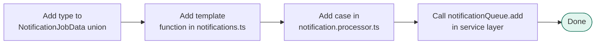

---

## Adding a new queue

Adding a new queue follows the same pattern every time: define the payload type, create the queue file, create the processor, create the worker, register the worker in the worker entrypoint, and add the queue to Bull Board. Each step has a direct reference implementation in the existing queues. The barrel export in `src/queues/index.ts` is the only import point — new queues are exported from there and nothing else in the app needs to know where the queue file lives.

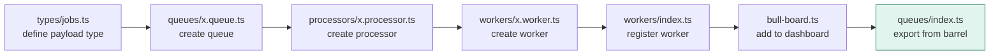